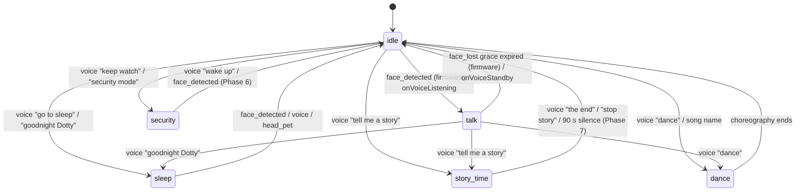

# States, Toggles & LED Contract

This document is the source of truth for Dotty's high-level modes. The model has two axes:

- **STATE** — what Dotty is *doing right now*. Mutually exclusive — exactly one State is active. Six values: `idle`, `talk`, `story_time`, `security`, `sleep`, `dance`.
- **TOGGLES** — orthogonal modifiers that can be on regardless of state. Two values today: `kid_mode`, `smart_mode`. Toggles compose freely with state.

The firmware **StateManager** modifier (`firmware/main/stackchan/modes/state_manager.{h,cpp}`) owns both axes. It paints the state arc (left ring 0-5) + toggle pips at 5 Hz, drives the idle-motion profile, and emits `state_changed` perception events on every transition. The **dotty-behaviour** perception bus (`dotty-behaviour/perception/state.py`) consumes those events and runs 11 consumer classes (the running set is config-gated) against them (`FaceGreeter`, `SoundTurner`, `FaceLostAborter`, `WakeWordTurner`, `FaceIdentifiedRefresher`, `PurrPlayer`, `SceneSynthesis`, `IdlePhotographer`, `SleepDreamer`, `DanceReflector`, `SecurityCycle`) — see [architecture.md](./architecture.md#perception-event-bus).

> **Submodule pin caveat.** Phase 4 shipped to the active firmware fork (`BrettKinny/StackChan @ dotty`, commit `d78118b`) on **2026-04-27**. The `firmware/firmware/` submodule pin in this repo deliberately lags upstream — it's a release pointer, not the active development tree. A user who flashes from the submodule will get a pre-Phase-4 firmware. Bump the submodule (or build from the active fork) to get the StateManager. Visual / interactive bench checks tracked in [issue #38](https://github.com/BrettKinny/dotty-stackchan/issues/38).

Pair this with [hardware.md](./hardware.md) (the physical LED ring + servos) and [interaction-map.md](./interaction-map.md) (the underlying signals).

---

## TL;DR

| Axis | Cardinality | Examples | Owner |
|---|---|---|---|
| State | mutex (1 of 6) | `idle`, `talk`, `story_time` | firmware StateManager |
| Toggle | compose freely | `kid_mode`, `smart_mode` | firmware StateManager + bridge state files |
| Chat sub-state | nested under `talk` / `story_time` | listening (LED) / thinking + speaking (face only) | xiaozhi-server |

The firmware boots into `idle` with both toggles **off**. The bridge resyncs toggles from disk on the first turn after each reconnect. State transitions land via voice phrases, camera edges (`face_detected` → `talk`), head-pet hold (sleep → idle), or `/xiaozhi/admin/set-state` from the dashboard.

**Speech sub-states** are conveyed by face animations (eye gestures, talking mouth) and the dedicated **listening pixel** at right-ring index 11. `thinking` and `speaking` have no LED — they live on the face. `listening` lights pixel 11 red so the user knows when their voice is being captured as a turn.

**Smart-mode is toggle-only today.** It flips the pip and the behaviour gate, but does **not** swap the backing model — the model-swap path is v2 scope (see `docs/cutover-behaviour.md`). The previous in-process Tier1Slim hot-swap has been removed along with the Tier1Slim provider.

---

## States (mutually exclusive)

| State | LED arc (left ring 0-5) | Idle profile | Behaviour | Backing path |
|---|---|---|---|---|
| `idle` | off `(0,0,0)` | NORMAL | Ambient awareness, gentle idle motion. Default. | n/a (no chat in flight) |
| `talk` | dim green `(0,60,0)` | NORMAL (face_tracking overlay active) | Conversation engaged. Listening pixel (right 11) lights red while the user has the turn; `thinking` and `speaking` are face-animation only. | xiaozhi → PiVoiceLLM → dotty-pi |
| `story_time` | warm `(100,40,0)` | NORMAL | Long-running interactive story. | Phase 7 PENDING — backing path unimplemented |
| `security` | white `(80,80,80)` **flashing 1 Hz** across all 6 left pixels (`kSecurityFlashHalfMs = 500`) | SURVEILLANCE | Wide deliberate scan, serious face, periodic photo + audio capture. No proactive greet. | Phase 8 PENDING — `SecurityCycle` consumer is scaffolding, not a live path |
| `sleep` | very dim blue `(0,0,16)` | SLEEPY | Head face-down + centred, servo torque off (with `kSleepTorqueReleaseTimeoutMs = 3000` fallback), sleeping emoji on screen, ambient awareness paused. Wakes on face / voice / head-pet. | firmware-only quiescence (Phase 5) |
| `dance` | rainbow sweep (left ring) | NORMAL | Transient performance — choreography + audio. Pre-existing dance handler. | `receiveAudioHandle.py::_handle_dance` |

The `idle → talk` trigger is the firmware `face_detected` event (any face, family or stranger) **or** `onVoiceListening` (the WS opens for a wake-word / inject-text / head-pet hold). dotty-behaviour runs VLM recognition in parallel and feeds the resulting identity into the speaker resolver / persona — recognition does **not** gate the state transition.

### Mutex rules

1. Exactly **one** state is current. `setState(S)` to the same state is a no-op.
2. State transitions are explicit — no implicit "fallback" to idle from other states; each non-idle state has its own exit triggers.
3. Camera edges only auto-transition between `idle` ↔ `talk`. Sticky states (`story_time`, `security`, `sleep`, `dance`) ignore `face_detected` / `face_lost`.

### Wake-from-sleep edges

`StateManager` accepts three sleep-exit triggers:

- **Face detected** (`onFaceDetected`) — wakes if `_state == State::Sleep`.
- **Voice listening** (`onVoiceListening`) — wakes on wake-word, inject-text, or any other path that opens the WS.
- **Head pet** (`onHeadPet`) — the dark-room friendly path; capacitive head touch wakes without line of sight or speech. See [voice-mode-entry.md](./voice-mode-entry.md).

---

## Toggles (compose freely)

| Toggle | Toggle pip (right ring) | What it does | Persistence |
|---|---|---|---|
| `kid_mode` | salmon pink `(220, 80, 80)` at index **8** (G == B so PY32 RGB565 quantization stays warm) | Guardrails only — content sandwich, camera tools denied, kid-safe persona. Does not pick the model. Bridge-side hot-reload via `_apply_kid_mode()` (no daemon restart). | `bridge` container state file |
| `smart_mode` | orange `(168, 80, 0)` at index **9** | Toggle-only today — flips the pip and behaviour gate. The model-swap it was designed to drive (ON → `SMART_MODEL` via OpenRouter; OFF → local default) is v2 scope and not wired on the `PiVoiceLLM` path. | `bridge` container state file |

The two toggles are orthogonal — they compose freely. `kid_mode = on` AND `smart_mode = on` runs the smart model behind the kid-safe sandwich. Both toggles are sticky across turns, daemon restarts, and reboots.

`smart_mode` is **dashboard- and admin-endpoint-only** — there is no voice trigger. Kids reach Dotty by voice but not the web dashboard, so dashboard-only is the access-control gate that keeps the more capable (and more expensive) model under household-head control.

---

## LED contract (12-pixel ring)

```
LEFT RING (global 0–5)              RIGHT RING (global 6–11)
┌───────────────────┐               ┌────────────────────────────┐
│ 0  state arc      │               │ 6  face state (TOP)        │
│ 1  state arc      │               │ 7  reserved (locked off)   │
│ 2  state arc      │               │ 8  kid_mode toggle         │
│ 3  state arc      │               │ 9  smart_mode toggle       │
│ 4  state arc      │               │ 10 reserved (locked off)   │
│ 5  state arc      │               │ 11 listening (BOTTOM)      │
└───────────────────┘               └────────────────────────────┘
```

| Index | Half | Owner | Behaviour |
|---|---|---|---|
| 0–5 | left | StateManager (state arc) | All six paint the current mutex-state colour. Dance suppresses and lets the rainbow animation own the ring. |
| 6 | right | StateManager (face state pip) | Yellow `(168, 140, 0)` when a face is detected; green `(0, 140, 30)` when the bridge has identified the face via room-view VLM + roster match (mutex on the same pixel). Identified state has a `kFaceIdentifiedTimeoutMs = 4000` firmware-side timeout, with `kFaceIdentifiedFlickerGraceMs = 1500` to ride out brief detection hiccups — bridge refreshes by calling `/xiaozhi/admin/set-face-identified` on each successful match. |
| 7, 10 | right | StateManager (locked off) | Reserved for future indicators (low-battery is a known candidate). Re-asserted to `(0,0,0)` every `kReassertIntervalMs = 200` ms as defense-in-depth. |
| 8 | right | StateManager (`kid_mode` pip) | Salmon pink `(220, 80, 80)` when kid_mode = on; off otherwise. G == B keeps the warm hue surviving RGB565 quantization (the prior `(168, 80, 100)` hue had B > G and read cool/magenta). |
| 9 | right | StateManager (`smart_mode` pip) | Orange `(168, 80, 0)` when smart_mode = on; off otherwise. |
| 11 | right | StateManager (listening pip) | Lit while xiaozhi is in `LISTENING` (mic open, ASR active, user's turn); off otherwise. Driven by `StateManager::setListening(bool)`. Bottom of the right ring; spatially separated from the toggle pips. |

### LED quirks

- **5 Hz tick.** StateManager re-paints the state arc AND the entire right ring (face / kid / smart / listening / reserved 7 / reserved 10) every `kReassertIntervalMs = 200` ms. The tick drives the SECURITY 1 Hz flash (`kSecurityFlashHalfMs = 500`) and the face-identified 4 s timeout, and acts as defense-in-depth re-assert across all status indicators — MCP writes / dance keyframes / future writers cannot persistently clobber any pixel (worst case: 200 ms flicker).
- **PY32 IO expander quantises to RGB565.** Brightness deltas crush — `(40,40,40)` reads almost identical to `(200,200,200)`. Use distinct **hues**, not brightness levels, for any indicator that needs to read across a room.
- **MCP tools are contract-aware.** `self.robot.set_led_color` and `self.robot.set_led_multi` are restricted to the LEFT ring only (indices 0-5). Attempts to write right-ring indices via these tools are rejected with a warn log. Use `/xiaozhi/admin/set-face-identified` to light the face pixel green for ~4 seconds.
- **Dance choreography only animates the left ring.** Custom JSON dances that set `rightRgbColor` will see that field preserved on the `Keyframe` struct but not applied to hardware.
- **RightNeonLight uses local indices 0–5** internally, mapped to global 6–11 via `+6`. StateManager constants: `kFacePipRightLocal=0`, `kReservedPipRightLocal_7=1`, `kKidModePipRightLocal=2`, `kSmartModePipRightLocal=3`, `kReservedPipRightLocal_10=4`, `kListeningPipRightLocal=5`.
- **Dashboard mirror.** The bridge dashboard at `/ui/led-ring-mirror` shows all four indicators in the same colours as the physical ring, updated via 2 s HTMX polling + `dotty-refresh` event nudges fired by SSE perception events (`face_detected`, `face_lost`, `face_recognized`, `chat_status`).

---

## State transitions



### Voice triggers

| Phrase (substring, case-insensitive) | Target state |
|---|---|
| `goodnight dotty` / `good night dotty` / `go to sleep` | `sleep` |
| `keep watch` / `security mode` / `watch the room` | `security` |
| `tell me a story` / `story time` | `story_time` |
| `wake up` / `come back` / `are you there` (only when state ∈ `{sleep, security, story_time}`) | `idle` |

Both `kid_mode` and `smart_mode` are voice-untoggleable — they are guardian-controlled axes driven from the bridge's `/admin/kid-mode` and `/admin/smart-mode` endpoints (or the dashboard cards that wrap them).

### Admin endpoints

| Endpoint | Body | Effect | Where |
|---|---|---|---|
| `POST /admin/kid-mode` | `{"enabled": bool}` | Persists + hot-reloads kid-mode globals atomically via `_apply_kid_mode()`. No daemon restart. Also pushes the kid pip via xiaozhi `/xiaozhi/admin/set-toggle`. | bridge (localhost-only) |
| `POST /admin/smart-mode` | `{"enabled": bool, "device_id": "<optional>"}` | Persists the toggle + pushes the smart pip. Model-swap is v2 scope (not wired on `PiVoiceLLM`). | bridge (localhost-only) |
| `POST /xiaozhi/admin/set-state` | `{"state": "<idle\|talk\|story_time\|security\|sleep\|dance>", "device_id": "<optional>"}` | Dispatches MCP `self.robot.set_state` onto the device WS; firmware StateManager applies it. | xiaozhi-server |
| `POST /xiaozhi/admin/set-toggle` | `{"name": "kid_mode\|smart_mode", "enabled": bool, "device_id": "<optional>"}` | Dispatches MCP `self.robot.set_toggle`; firmware StateManager updates the pip without disturbing the active state. | xiaozhi-server |
| `POST /xiaozhi/admin/set-face-identified` | `{"device_id": "<optional>"}` | Lights the face-identified pixel green; refresh required every < `kFaceIdentifiedTimeoutMs` (4 s) to hold. | xiaozhi-server |

### MCP tools (firmware)

| Tool | Arguments | Caller |
|---|---|---|
| `self.robot.set_state` | `{"state": "<...>"}` | xiaozhi-server `/xiaozhi/admin/set-state` relay |
| `self.robot.set_toggle` | `{"name": "kid_mode\|smart_mode", "enabled": bool}` | xiaozhi-server `/xiaozhi/admin/set-toggle` relay; receiveAudioHandle.py voice phrases |
| `self.robot.set_face_identified` | `{}` | xiaozhi-server `/xiaozhi/admin/set-face-identified` relay |

---

## Backing architecture per state

| State | Voice path | Memory? | Tools? |
|---|---|---|---|
| `idle` | n/a | n/a | n/a |
| `talk` | xiaozhi → PiVoiceLLM → dotty-pi | yes (FTS via `memory_lookup` / `remember` tools in dotty-pi-ext) | yes (5-tool dotty-pi-ext catalogue) |
| `story_time` | Phase 7 PENDING — backing path unimplemented | n/a (pending) | n/a (pending) |
| `security` | Phase 8 PENDING — `SecurityCycle` consumer is scaffolding, no live path | n/a (pending) | n/a (pending) |
| `sleep` | mic stays on for "wake up"; no LLM round-trip | n/a | n/a |
| `dance` | bridge handler dispatches choreography + audio file | n/a | dance MCP |

`smart_mode` is a toggle only and sticky across turns; the backing model-swap it was designed to drive is v2 scope and not wired on the `PiVoiceLLM` path. `story_time` (when implemented) would be the only voice path with its own session memory (Phase 7 pending).

---

## Implementation status

| Phase | Scope | Status |
|---|---|---|
| 4 | StateManager foundation: state pip + toggle pips + `state_changed` event + voice phrases + admin endpoints + LED contract | ✅ shipped 2026-04-27 (firmware `d78118b`, bridge+xiaozhi `10cbc63`). Bench checks pending: [#38](https://github.com/BrettKinny/dotty-stackchan/issues/38). |
| 5 | Sleep state behaviour (servo park + torque off + sleepy emoji + wake triggers) | ✅ shipped; bench checks: [#39](https://github.com/BrettKinny/dotty-stackchan/issues/39). |
| 6 | Security state firmware behaviour (LED flash + surveillance idle profile) | ✅ firmware rails shipped; the backing capture path is **Phase 8 PENDING** (see below). Bench checks: [#40](https://github.com/BrettKinny/dotty-stackchan/issues/40). |
| 7 | Story_time backing path (interactive setup, LLM session, choose-your-own-adventure) | **PENDING / unimplemented**: [#26](https://github.com/BrettKinny/dotty-stackchan/issues/26). |
| 8 | Security backing path / ambient awareness loop (periodic photo + audio scene capture, journal) | **PENDING** — the `SecurityCycle` consumer in `dotty-behaviour/consumers/` is scaffolding, not a live path; firmware state binding pending. Tracked alongside #26. |

Phase 4 established the *rails* — pip, transition events, dispatch helpers, voice routing. Phase 5 hangs sleep behaviour off those rails and has shipped. The `story_time` and `security` **backing paths** (Phases 7–8) are both unimplemented; the `SecurityCycle` consumer exists only as scaffolding.

---

## Sources of truth

- **Firmware (active fork `BrettKinny/StackChan @ dotty`):** `firmware/main/stackchan/modes/state_manager.{h,cpp}`, `firmware/main/stackchan/modifiers/face_tracking.cpp` (camera-edge hooks), `firmware/main/hal/hal_mcp.cpp` (set_state / set_toggle MCP). **This repo's submodule pin lags** — bump it (or maintain a parallel checkout per the [`firmware/`](../firmware) README) to flash a build that includes Phase 4+.
- **Perception + ambient behaviour:** `dotty-behaviour/perception/state.py` (the perception event bus + per-device `current_state` from `state_changed`) and `dotty-behaviour/consumers/` (the 11 consumer classes — the running set is config-gated: `FaceGreeter`, `SoundTurner`, `FaceLostAborter`, `WakeWordTurner`, `FaceIdentifiedRefresher`, `PurrPlayer`, `SceneSynthesis`, `IdlePhotographer`, `SleepDreamer`, `DanceReflector`, `SecurityCycle`). The old `bridge.py` `_perception_*` / `_update_perception_state` / `_capture_room_view` methods are retired.
- **Bridge:** `bridge.py` (admin dashboard + the `/admin/kid-mode` and `/admin/smart-mode` toggle relays), `receiveAudioHandle.py` (voice state phrases + per-conn toggle sync). The voice-path model-swap helpers (`_apply_model_swap`, `_apply_tier1slim_runtime`) are retired along with the Tier1Slim provider; smart-mode model-swap is v2 scope.
- **xiaozhi-server patches:** `custom-providers/xiaozhi-patches/http_server.py` (`/xiaozhi/admin/set-state`, `/xiaozhi/admin/set-toggle`, `/xiaozhi/admin/set-face-identified`, `/xiaozhi/admin/inject-text`, `/xiaozhi/admin/abort`, `/xiaozhi/admin/set-head-angles`), `custom-providers/xiaozhi-patches/textMessageHandlerRegistry.py` (`state_changed` → `conn.current_state`, perception relay to dotty-behaviour)
- **Dashboard:** `bridge/dashboard.py` + `bridge/templates/state_card.html` + `bridge/templates/smart_mode.html` + `bridge/templates/led_ring_mirror.html`

Last verified: 2026-05-17.
